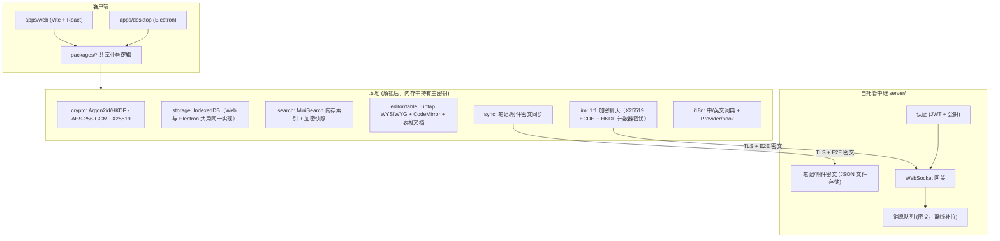
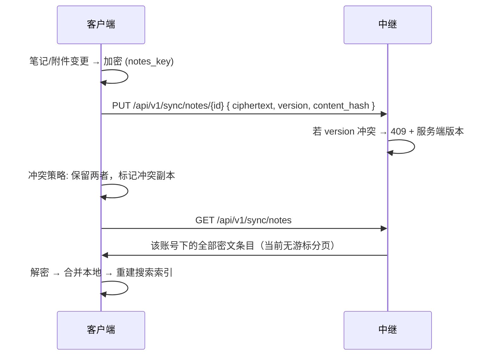

# FastNote 架构设计

> 版本：v0.1 · 个人/小团队 · Electron + Web + 自托管服务端 · 零知识
>
> 本文档描述**当前实现**的架构（而非最初的设计草案）。如果你在阅读源码时发现与本文有出入，以源码和 `memory-bank/systemPatterns.md` 为准，并请一并更新本文档。

## 1. 已确认决策

| 项 | 决策 |
|----|------|
| 技术栈 | Web（Vite + React）与 Electron 桌面版共享同一套 `packages/*` 业务逻辑 |
| 笔记编辑 | 默认 WYSIWYG（底层 Markdown），可切换源码模式；另支持表格（CSV/`.fnxt`）文档类型 |
| 账号 | 本地库可脱离账号独立使用；登录云账号后笔记/表格/附件端到端加密同步，聊天需要账号 |
| 服务器 | 自托管中继（零知识，仅存密文），JSON 文件持久化 |
| 密钥恢复 | 严格模式，忘记密码不可恢复，无恢复码/后门 |
| IM | 1:1 端到端加密聊天 + 文件/图片附件 |
| 搜索 | 本地加密全文索引（MiniSearch） |
| 多语言 | 内置 i18n（中文/英文），语言偏好本地持久化 |
| 多保险库 | 支持同一设备维护多个独立加密库（vault registry） |
| 扩展 | 无插件系统；界面主题为内置的几套配色（非用户自定义主题引擎） |

## 2. 系统架构



## 3. Monorepo 结构

```
FastNote/
├── apps/
│   ├── web/              # Vite + React 浏览器版壳层
│   └── desktop/          # Electron 主进程 + 复用同一套 React 渲染层
├── packages/
│   ├── shared/           # 跨包类型定义、常量、纯函数工具（含 CSP 构建）
│   ├── crypto/           # 密钥派生 / AES-GCM / X25519 等原语封装（@noble/*）
│   ├── storage/          # IndexedDB 适配层（idb），Web/Electron 共用
│   ├── search/           # MiniSearch 封装的本地全文索引
│   ├── sync/             # 笔记/附件云同步客户端（push/pull + 冲突标记）
│   ├── im/               # 1:1 聊天协议客户端（WebSocket 封装、消息编解码、重连）
│   ├── editor/           # Tiptap（WYSIWYG）+ CodeMirror（源码模式）封装
│   ├── table/            # 表格文档模型、CSV/.fnxt 导入导出
│   ├── api/               # HTTP ApiClient + 所有 localStorage 设置的读写函数
│   ├── i18n/              # 中/英文词典、I18nProvider、useT() hook、语言持久化
│   ├── app/               # VaultApp：整个应用的顶层状态机和业务编排
│   └── ui/                # 纯展示型 React 组件（NoteTree、ChatPanel、SettingsModal…）
└── server/                 # 自托管中继：Fastify + WebSocket + JSON 文件存储
```

**依赖方向**：`app` 依赖几乎所有其它 package，是唯一的"编排层"；`ui`/`editor`/`table` 是展示型组件，通过 props 回调与 `app` 通信，同时直接依赖 `i18n` 做界面文案翻译；`shared` 和 `i18n` 是最底层的公共依赖，不依赖任何其它内部包。

## 4. 密钥体系

```
用户主密码 (仅内存，不上传)
    │
    ▼ Argon2id / HKDF (salt=随机，存本地)
主密钥 MK (256-bit，仅内存)
    ├── notes_key     → 笔记/表格内容 + manifest AES-256-GCM
    ├── index_key     → 搜索索引快照加密
    └── wrap_key      → 包装 identity/exchange keypair

首次创建加密库时生成 (随机，MK 加密后存本地):
    ├── identity_keypair  (签名用)
    └── exchange_keypair  (X25519，用于聊天密钥交换)

1:1 聊天:
    X25519 ECDH(我的 exchange 私钥, 对方 exchange 公钥)
      → HKDF 派生 root key（不依赖 MK，双方各自派生出相同值）
      → 按发送计数器 HKDF 派生每条消息的一次性 AES-GCM 密钥
```

**严格模式**：无 MK = 无法解密任何数据；不提供恢复码。

**说明**：当前聊天密钥交换是"静态 X25519 ECDH + 计数器派生消息密钥"，***不是*** Signal 风格的 X3DH + Double Ratchet（无预密钥/前向棘轮），复杂度更低但仍保证服务器不可见明文、且每条消息使用独立密钥。如果需要更强的前向保密/后向保密属性，这是已知的后续增强方向。

## 5. 笔记与表格模块

### 5.1 资源管理器

- 虚拟文件树：`folder` / `note` / `table` 三种节点类型
- 操作：新建、重命名、移动（拖拽排序）、删除、按文件夹批量导入
- 批量导入：选择本地文件夹后保留原目录结构；无扩展名文件→笔记，`.csv`→表格
- 树结构元数据经 `notes_key` 加密后存本地 + 同步到服务器

### 5.2 编辑器

| 模式 | 实现 | 存储 |
|------|------|------|
| WYSIWYG（默认） | Tiptap + `@tiptap/markdown` | Markdown 字符串 |
| 源码 | CodeMirror 6 | 同一 Markdown 字符串 |
| 表格 | 自研表格文档模型（`packages/table`） | JSON（列/行）序列化字符串 |

切换模式时双向转换，autosave 防抖 500ms。表格支持排序、筛选、列增删改名、CSV 导入导出、加密 `.fnxt` 文件导入导出。

### 5.3 附件

- 笔记内附件与聊天附件均端到端加密（`notes_key` 分别加密 meta 与数据）
- 支持从笔记/表格正文引用附件（嵌入式 chip 展示，可编辑描述、下载、移除引用）
- 登录云账号后自动增量同步（`packages/sync` 的 attachment push/pull）

### 5.4 云同步



- 同步粒度：单笔记文档（含表格，统一走 note 记录）+ 附件
- 版本：`version` (递增) + `content_hash`
- 离线：本地标记 `pending`，联网/登录后触发同步

## 6. 全文搜索（本地加密索引）

**策略**：索引仅存在于客户端，不上传明文。

1. 解锁后，从解密笔记（含表格转文本）构建 **MiniSearch** 内存索引
2. 退出/锁屏时，将索引序列化 → AES-GCM(`index_key`) → 存本地快照
3. 下次解锁：加载快照 → 解密 → 增量更新
4. 搜索仅在解锁态执行，结果高亮跳转

不上传索引到服务器（避免泄露词频/结构）。

## 7. IM 模块（1:1）

- 注册/更新公钥：`PUT /api/v1/keys` 上传 `identity_pubkey` + `exchange_pubkey`（公钥明文，符合零知识模型——服务器只做"公钥黄页"）
- 发消息：X25519 ECDH + HKDF 计数器密钥加密 → WebSocket 推送；对方离线则服务器暂存密文队列
- 收消息：在线走 WebSocket 实时推送；离线消息通过 `GET /api/v1/messages/pending` 补拉，ack 后 `DELETE`
- 消息与附件本地永久保存（IndexedDB），与是否登录无关；聊天记录不参与笔记同步管线
- 未读计数、气泡/音效通知设置可在设置中配置
- 不含：群聊、消息编辑/撤回、已读回执（Phase 2 预留）

## 8. 安全清单

| 威胁 | 对策 |
|------|------|
| 服务器窥探 | 全 E2E，服务器只见密文（笔记/表格/附件/聊天正文） |
| 密码暴力 | Argon2id 高成本参数派生主密钥 |
| 本地窃取 | IndexedDB 内容全密文；MK 仅内存；锁屏/关闭后需重新输入密码 |
| 中间人 | 生产部署要求 TLS（见 `docs/DEPLOYMENT.md`） |
| 重放 | AEAD nonce + 消息发送计数器 |
| 恶意/被污染依赖外联 | 运行时 CSP 白名单仅放行用户配置的服务器地址（见下） |

### Content-Security-Policy：运行时网络白名单

`packages/shared/src/csp.ts` 里的 `buildContentSecurityPolicy(serverUrl)` 是策略字符串的唯一权威来源：只放行 `'self'` + 用户当前配置服务器的 HTTP(S)/WS(S) 源，其余一律拒绝。

浏览器只会在 HTML **解析阶段**应用一次 `<meta http-equiv="Content-Security-Policy">`；解析完成后无论用 JS 怎么修改/重新插入这个 `<meta>` 标签，浏览器都会直接忽略，不会影响已经生效的策略（`<meta>` 节点本身确实会更新，但安全策略不会）。所以这条策略不能像最初设想的那样在 React `useEffect` 里"运行时更新"——`apps/web/index.html` 和 `apps/desktop/index.html` 顶部各有一段内联、非 `module`、非 `async` 的 `<script>`，会在文档解析到这里时**同步**执行：读取 `localStorage` 里的 `fastnote_server_url`（与 `packages/api` 用的是同一个 key，取不到则回退到默认值 `http://localhost:8787`），据此算出 `connect-src`，再用 `document.write()` 把 `<meta>` 写入文档流——这必须发生在解析到任何其他资源标签（脚本、样式表）之前，也是这段脚本必须是 index.html 里第一个元素的原因。这段逻辑和 `csp.ts` 里的算法保持手动同步（无法在这里 `import` 模块，因为此时任何脚本都还没加载）。

**推论**：运行时更改服务器地址（设置面板或解锁页的"云账户同步"标签）无法让已经生效的 CSP 变宽——`serverUrlNeedsReload()` 会对比 `window.__FASTNOTE_CSP_SERVER_URL__`（引导脚本写入的值）和新地址，如果不一致就提示用户刷新页面，让引导脚本重新读取最新的 `localStorage` 值并生成新的策略。

注意 CSP 里不包含 `frame-ancestors`：浏览器规范规定通过 `<meta>` 传递的 CSP 会**静默忽略**这个指令（只有真正的 HTTP 响应头才有效），写了只会在控制台产生无意义的警告。如果自托管部署需要防点击劫持，应在实际服务静态资源的 Web 服务器（nginx 等）上通过 `add_header Content-Security-Policy "frame-ancestors 'none'"` 设置真正的响应头。

**新增任何第三方网络请求（字体 CDN、图床、AI API 等）都必须同步更新 `csp.ts` 和两份 `index.html` 里的引导脚本**，这是刻意设计的摩擦，用来防止引入非自托管的外部依赖。

### Electron 加固

- `contextIsolation: true`, `nodeIntegration: false`
- 预加载脚本（`preload.ts`）只暴露最小 IPC API（数据目录选择等）
- 主进程拒绝一切权限请求（摄像头/麦克风/地理位置/通知）
- 拦截 `will-navigate` 与 `window.open`：应用窗口本身禁止导航，`http(s)://` 链接改用系统默认浏览器打开，禁用 webview

### Web 版限制

- 数据存 IndexedDB（同样加密），与桌面版是同一套存储实现
- 刷新/关闭标签页后需重新输入密码解锁
- 功能与桌面版一致（无本地文件系统目录选择能力）

## 9. 国际化（i18n）

- `packages/i18n`：自研轻量方案（无第三方 i18n 库），包含中/英文词典（`locales/zh.ts` / `locales/en.ts`）、`I18nProvider`、`useT()` / `useLocale()` hook，以及非 React 场景用的纯函数 `translate(locale, key, vars)`
- 语言偏好存于 `localStorage`（键 `fastnote_locale`），未设置时按浏览器语言自动检测（`zh-*` → 中文，其余 → 英文）
- 在设置弹窗中可随时切换语言，即时生效
- 非组件的工具函数（`packages/table/src/utils.ts`、`packages/api` 的 `ApiClient` 等）通过显式传入 `locale` 参数使用 `translate()`，因为它们不在 React 渲染上下文中，无法使用 hook

## 10. 自托管部署

详见 `docs/DEPLOYMENT.md`（HTTPS + Nginx 共存 + Certbot 自动续期的完整指南）。要点：

```bash
# server/.env（从 .env.example 复制）
PORT=8787
JWT_SECRET=<随机值，生产必须显式设置>
DATA_DIR=./data
```

```bash
cd server && docker compose up -d
```

组件：Fastify HTTP + WebSocket；持久化用自研 `JsonRelayStore`（JSON 文件，见 `docs/DATABASE.md`），服务端仅存密文/元数据，不存任何明文内容。

## 11. 构建与发布目标

| 平台 | 产物 | 工具 |
|------|------|------|
| Web | 静态资源 | `vite build`，任意静态托管 + 反向代理 |
| macOS 桌面版 | `.dmg`（universal） | `electron-builder --mac` |
| Windows 桌面版 | `.exe`（NSIS） | `electron-builder --win` |
| Linux 桌面版 | `AppImage` + `.deb` | `electron-builder --linux` |
| 自托管服务端 | Docker 镜像 | `docker compose up -d` |

Web 与 Electron **共享** `packages/*`，仅壳层不同。三平台桌面客户端由 `.github/workflows/release-desktop.yml` 在 push 到 `publish` 分支时自动构建并发布为 GitHub Release（详见 `memory-bank/techContext.md`）。
