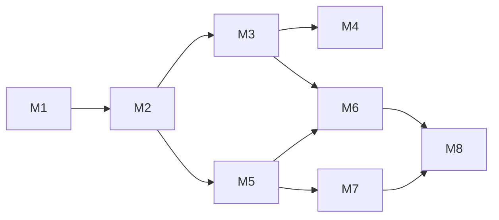

# Phase 1 任务拆解（MVP 基础）— 历史规划 + 完成情况

> 本文档是项目启动时的里程碑规划草案。**下面已标注实际完成情况**；部分技术选型在实现过程中发生了变化（例如 Electron 也使用 IndexedDB 而非 SQLite，IM 密钥交换用了更简单的方案而非 X3DH/Double Ratchet）。当前系统的准确描述见 `docs/ARCHITECTURE.md` / `docs/DATABASE.md` / `docs/PROTOCOL.md`，本文件仅作历史记录保留。

## 里程碑 M1 — 项目骨架（Week 1）✅ 已完成

- [x] Monorepo 脚手架（pnpm workspaces）
- [x] `packages/shared` 类型定义
- [x] `packages/crypto`：Argon2id（`@noble/hashes`）、AES-GCM、HKDF、密钥包装
- [x] `apps/web` Vite + React 骨架
- [x] `apps/desktop` Electron + 共享 renderer
- [x] ESLint + TypeScript 严格模式

## 里程碑 M2 — 解锁与本地存储（Week 2）✅ 已完成（存储方案有调整）

- [x] 首次启动：设置密码 → 生成 salt、verifier、identity/exchange keypair
- [x] 解锁屏 UI（支持本地库解锁 + 云账户同步登录两种路径，深浅色可视化选中态）
- [x] `packages/storage`：~~Web IndexedDB / Electron SQLite 适配器~~ **实际为 Web 与 Electron 统一使用 IndexedDB（`idb`）**，未引入 `better-sqlite3`
- [x] 锁屏：清零内存中的 MK
- [ ] ~~Electron 主进程 SQLite IPC~~（未采用，因存储引擎统一为 IndexedDB，此项不再需要）
- [x] 追加实现：多保险库支持（`fastnote_vault_registry`，同设备可维护多个独立加密库）

## 里程碑 M3 — 笔记树 + 编辑器（Week 3–4）✅ 已完成（范围有扩展）

- [x] 资源管理器 UI：folder/note/**table**（三种节点类型）树、CRUD、拖拽排序
- [x] `packages/editor`：Tiptap WYSIWYG ↔ Markdown
- [x] CodeMirror 源码模式切换
- [x] 工具栏（标题、加粗/斜体、列表、代码块、链接等）
- [x] Autosave → 加密写入 `notes_local`
- [x] 追加实现：`packages/table` 表格文档（CSV/加密 `.fnxt` 导入导出、排序筛选）
- [x] 追加实现：笔记/表格附件（加密存储、嵌入式引用、正文内 chip 展示）
- [x] 追加实现：按文件夹批量导入（保留目录结构，无扩展名→笔记，`.csv`→表格）
- [x] 追加实现：笔记内容区宽度可调、设置面板滚动条

## 里程碑 M4 — 全文搜索（Week 4）✅ 已完成

- [x] `packages/search`：MiniSearch 封装
- [x] 解锁时构建/加载加密索引快照
- [x] 搜索 UI + 结果跳转
- [x] 笔记变更增量更新索引

## 里程碑 M5 — 服务端 + 账号（Week 5）✅ 已完成（存储方案有调整）

- [x] `server/` Fastify REST + WebSocket
- [x] 注册/登录 API
- [x] Docker Compose 自托管
- [x] 客户端设置：服务器地址配置（并驱动运行时 CSP 白名单，见 `docs/ARCHITECTURE.md` §8）
- [x] 持久化：~~SQLite~~ **实际为自研 `JsonRelayStore`，单文件 JSON 持久化**（见 `docs/DATABASE.md`），未引入 SQLite

## 里程碑 M6 — 笔记云同步（Week 6）✅ 已完成（无独立 manifest 接口）

- [x] `packages/sync`：push/pull、基于 `syncStatus` 字段标记待同步项（未采用独立的 `sync_queue` 表）
- [ ] ~~manifest 同步（目录树）~~（未采用；目录树信息随每个节点密文一起同步，无独立接口）
- [x] 冲突标记为「冲突副本」
- [x] 同步状态指示器 UI
- [x] 附件同步（`packages/sync` 中随笔记一起处理 push/pull）

## 里程碑 M7 — 1:1 E2E 聊天（Week 7–8）✅ 已完成（加密方案简化）

- [ ] ~~Prekey 上传/获取~~（未实现，无 `/api/v1/keys/bundle` 接口，无 prekeys 表）
- [ ] ~~X3DH + Double Ratchet（`packages/im`）~~ **实际实现为：静态 X25519 ECDH 派生 root key + 按发送计数器 HKDF 派生每条消息的一次性 AES-GCM 密钥**（无前向棘轮/预密钥），见 `docs/ARCHITECTURE.md` §4 说明
- [x] WebSocket 消息收发
- [x] 离线消息 pull（`/api/v1/messages/pending` + 定期轮询兜底）
- [x] 聊天 UI（会话列表、消息气泡、未读红点、新消息提醒气泡+音效设置）
- [x] 追加实现：聊天附件（图片/文件，内嵌在加密消息体中传输，二次删除确认）

## 里程碑 M8 — Electron 打包（Week 9）✅ 已完成（发布方式有扩展）

- [x] electron-builder macOS dmg（universal）
- [x] electron-builder Windows nsis
- [x] electron-builder Linux AppImage/deb（超出原计划，追加支持）
- [x] 应用图标、关于页、锁屏
- [x] README 部署文档 + `docs/DEPLOYMENT.md`（HTTPS/Nginx/Certbot 完整指南）
- [x] 追加实现：GitHub Actions（`.github/workflows/release-desktop.yml`）在 `publish` 分支自动构建三平台安装包并发布 Release

## 已完成但未在原计划中的能力

- 界面主题（温馨/典雅/商务/清新等内置配色）、解锁页/设置页选中态深浅色视觉规范
- 国际化 i18n（`packages/i18n`，中/英文，语言偏好本地持久化，设置中可切换）
- 消息通知设置（气泡开关 + 多种音效 + 音量）、未读消息计数气泡
- 运行时 CSP 白名单机制，仅放行用户配置的自托管服务器地址（见 `docs/ARCHITECTURE.md` §8）

## 依赖关系（原始规划，仍有效）

## 技术依赖清单（实际使用，已更新）

| 包 | 用途 |
|----|------|
| `@tiptap/react` + `@tiptap/markdown` | WYSIWYG 编辑器 |
| `@codemirror/lang-markdown` | 源码模式 |
| `@noble/hashes`（含 Argon2 相关派生） | 密码/密钥派生 |
| `@noble/ciphers` + `@noble/curves` | AES-GCM / X25519 |
| `minisearch` | 全文搜索 |
| `idb` | Web **与 Electron 统一**使用的 IndexedDB 封装（~~`better-sqlite3`~~ 未使用） |
| `fastify` + `@fastify/websocket` | 服务端 HTTP + WebSocket（持久化为自研 JSON 文件存储，非 SQLite） |
| `electron-builder` | 三平台桌面安装包打包 |

## Phase 2 预留（不在当前实现范围）

- 群聊
- 消息编辑/撤回、已读回执
- 更强的聊天前向保密方案（预密钥体系 / Double Ratchet），当前为简化的静态 ECDH + 计数器密钥派生
- 多设备同时在线接收推送（当前每账号仅保留一个 WebSocket 连接）
- 证书固定、第三方安全审计
- 更多语言（当前仅中/英文）
